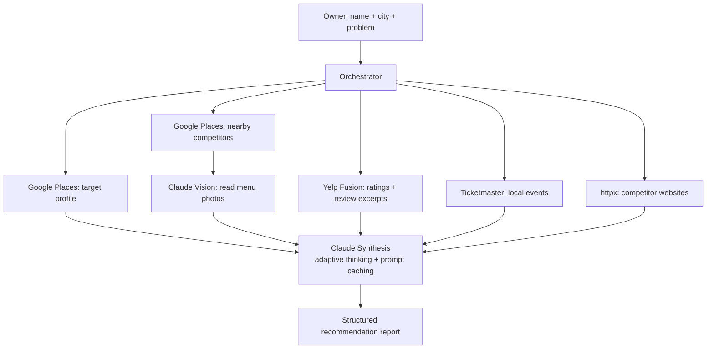

# Restaurant Intelligence Agent

An agentic competitive-intelligence tool for independent restaurant owners. Type your
restaurant name and city. The agent autonomously gathers competitor data from four live
public APIs, **reads competitor menus from photos via vision AI**, and returns specific,
data-grounded recommendations — framed the way a strategy consultant would, not as a raw
JSON dump.

**Live demo:** _coming soon_ (deploy to Streamlit Community Cloud — see below)

---

## The Problem

Google gives a restaurant owner a star rating and a pin on a map. What it doesn't give
them is the thing they actually need: *what are the four Italian places within a quarter
mile doing on their menus, what are people praising them for, and where's the gap I can
own?* This agent assembles that picture automatically — the owner provides two inputs, the
agent does the rest.

---

## Architecture



- **Model:** `claude-sonnet-4-6` (one constant in `agent/config.py`) — strong vision + tool
  use at lower cost than Opus, which suits a multi-call agent.
- **Adaptive thinking** on the vision and synthesis calls (no fixed `budget_tokens`).
- **Prompt caching** on the synthesis system prompt, so repeat runs pay ~0.1× for that block.

---

## How It Works

The orchestrator (`agent/orchestrator.py`) runs a deterministic 8-step pipeline. Each step
is an independently testable tool under `agent/tools/`:

1. **Target profile** — Google Places Text Search → Place Details.
2. **Competitors** — Google Places Nearby Search, filtered to the same cuisine, ranked by
   review volume; pulls up to 5 photo references per competitor.
3. **Menus (vision)** — for each photo, Claude decides "is this a menu?" and, if so,
   extracts dishes, prices, categories, and specials. Non-menu photos are skipped.
4. **Reviews** — Yelp Fusion business data + up to 3 review excerpts for the target and
   top 3 competitors.
5. **Events** — Ticketmaster Discovery, scoped to the relevant weekday if the owner's
   problem mentions one (e.g. "slow **Tuesdays**").
6. **Websites** — best-effort fetch of competitor sites for specials the photos missed.
7. **Synthesis** — all of it goes to Claude, which returns a grounded diagnosis,
   market gaps, exactly 3 prioritized recommendations, and a "what not to do".
8. **Report** — assembled into a structured object for the UI.

The Streamlit UI streams each step's status live, so the agent's work is visible during a
demo rather than hidden behind a spinner.

---

## Eval Results

20 hand-written cases across three categories live in `eval/cases.json`:

- **Data retrieval (8)** — target found AND ≥ 3 competitors identified.
- **Recommendation quality (8)** — exactly 3 recommendations, each with a rationale, no
  generic phrases ("improve service quality"), each containing a number (specificity
  signal) and naming a real competitor (grounding signal).
- **Hallucination (4)** — every competitor name in the output is a subset of the names
  Google Places actually returned (zero fabricated names).

Run it (uses live API calls — `--limit` while iterating):

```bash
python eval/run_eval.py --limit 3   # smoke test
python eval/run_eval.py             # full suite
```

Results table will be pasted here after the first full run against live keys.

---

## What This Doesn't Do (Yet)

- **Yelp free tier returns at most 3 reviews per business**, excerpts only — analysis is
  based on a sample, enough to surface themes but not a full sentiment read.
- **Google Places photo availability varies.** Some restaurants have only exterior shots,
  no menu photos. Vision extraction is best-effort.
- **Menu prices may be outdated** if the photos are old.
- **No historical trend data** — analysis is a current snapshot only.
- **Events are ticketed-only** (Ticketmaster). Farmers markets, street festivals, and
  neighborhood events won't appear.
- **English-language menus only** — non-English menu text is not extracted.

---

## Running Locally

Requires **Python 3.10+** (runs on 3.9 too, but 3.10+ is recommended).

```bash
python -m venv .venv && source .venv/bin/activate
pip install -r requirements.txt

cp .env.example .env   # then fill in your four API keys
streamlit run app.py
```

Test any tool in isolation, e.g.:

```bash
python -c "from agent.tools.google_places import get_restaurant_profile; \
import json; print(json.dumps(get_restaurant_profile('Piccolo Forno', 'Pittsburgh'), indent=2))"
```

**API keys** (all have free tiers): Anthropic, Google Places ($200/mo credit),
Yelp Fusion, Ticketmaster Discovery.

---

## Deployment (Streamlit Community Cloud)

1. Push this repo to GitHub.
2. Go to [share.streamlit.io](https://share.streamlit.io) and connect the repo.
3. Add the four keys in the **Secrets** manager (same names as `.env.example`).
4. Deploy — you get a public URL. Real keys never live in the repo; `.env` is gitignored.

---

## At Scale: What Would Change

- **Cache the expensive calls.** Google profiles and competitor sets are stable for days —
  a Redis/Postgres cache keyed by `(name, city)` would cut Google spend dramatically and
  make repeat analyses instant.
- **Move vision off the request path.** Menu extraction is the slowest, priciest step.
  Pre-process competitor photos in a background job (Batches API at 50% cost) and store
  structured menus; the live request just reads them.
- **Stronger competitor matching.** Cuisine matching here is keyword-based on Google
  `types`. At scale, embed menus and rank competitors by menu similarity, not just category.
- **Persist reports + feedback** to track which recommendations owners actually adopt, and
  feed that back into prompt tuning.
- **Rate-limit and queue** per the free-tier ceilings (Ticketmaster 5k/day, Yelp daily cap).
